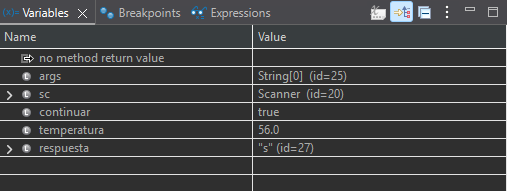
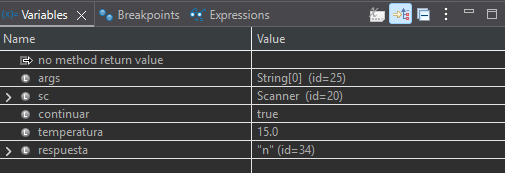

# PR-Eclipse-06-depurarErrores

## APARTADO 2: 
## Depura y soluciona los errores de ejecución... Muéstrame un pantallazo de al menos un error que puedas encontrar depurando y explícame mediante el contenido de las vistas que estaba ocurriendo y cómo lo has solucionado.

### ERROR 1

En la función pedirTemperatura el codigo nunca va a entrar en el if y nunca se va a repetir el bucle si el número introducido es incorrecto por que el operador logico que usa es un && (AND) y un valor no puede ser a la vez menor que -10 y mayor que 50. Lo he arreglado cambiando el operador lógico por un | | (OR).

Vista de las variables mientras hacia el debug

   

temperatura es 56 y aun así me deja continuar con ese valor

**Código erróneo**
``` java
        do {
            System.out.print("Introduce la temperatura en grados: ");
            t = sc.nextDouble();
            
            if (t < -10 && t > 50) {
                System.out.println("Temperatura fuera del rango permitido (-10 a 50)."); 
            }
            
        } while (t < -10 && t > 50);
```

**Código correcto**
``` java
        do {
            System.out.print("Introduce la temperatura en grados: ");
            t = sc.nextDouble();
            
            if (t < -10 || t > 50) {
                System.out.println("Temperatura fuera del rango permitido (-10 a 50)."); 
            }
            
        } while (t < -10 || t > 50);
```

### ERROR 2

En el main, en el bucle while, el if comprueba si la respuesta del usuario es n o N para tener en cuenta la mayuscula y aun así aunque escribas una n por teclado no entra en el if y no termina el programa por que esta comparando dos strings con el operador == y este solo comparar la referencia a la que apunta en memoria. Hay que hacerlo con .equals para que compare el contenido en sí de la variable. En este caso he usado .equalsIgnoreCase para no poner dos veces lo mismo y que no importe si es mayúscula o minúscula.

Vista de las variables mientras hacia el debug

  

respuesta es "n", continuar sigue siendo true, y no finaliza el programa

**Código erróneo**
``` java
        while (continuar) { 
            double temperatura = pedirTemperatura(sc); 
            mostrarResultado(temperatura);

            System.out.print("¿Desea introducir otra temperatura? (s/n): ");
            String respuesta = sc.next();

             if (respuesta == "n" || respuesta == "N") { 
            	continuar = false; 
            }     
        }
```

**Código correcto**
``` java
        while (continuar) { 
            double temperatura = pedirTemperatura(sc); 
            mostrarResultado(temperatura);

            System.out.print("¿Desea introducir otra temperatura? (s/n): ");
            String respuesta = sc.next();

             if (respuesta.equalsIgnoreCase("n")) { 
            	continuar = false; 
            }     
        }
```

## Apartado 3
## ¿Piensas que la documentación de un programa es necesaria?

Aunque sea una parte aburrida de programar, la documentación es necesaria para entender lo que hace el código y cómo funciona, sobretodo cuando no lo has escrito tú. También es muy importante para mejorar la legibilidad y que si un programador quiere mirar un código y saber qué hace lo sepa de forma rápida leyendo los comentarios y qie no tenga que pararse a leer el código línea por línea o que no tenga que debuggearlo para saber en qué consiste.


